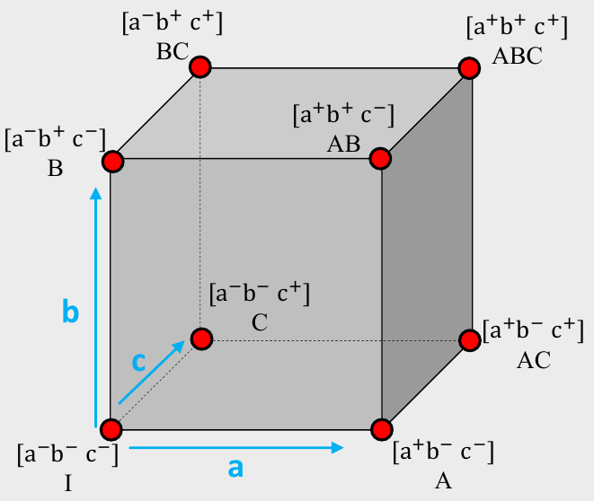
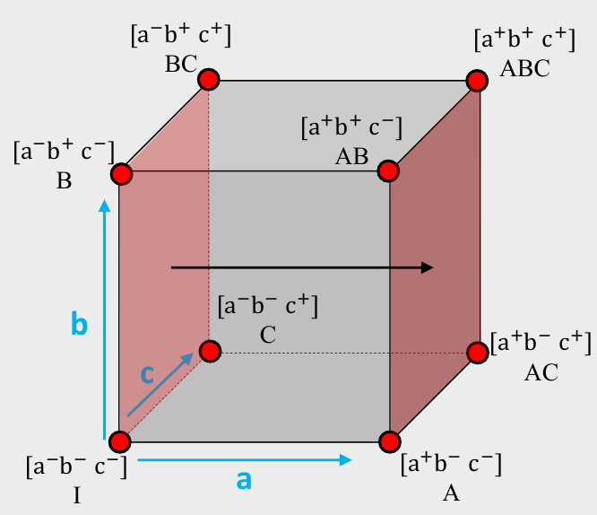

```{r setup, include=FALSE}
library(knitr)
library(fontawesome)
library(tidyverse)
library(metathis)
library(logitr)

options(
  htmltools.dir.version = FALSE,
  knitr.table.format = "html",
  knitr.kable.NA = '',
  dplyr.width = Inf,
  width = 250
)

knitr::opts_chunk$set(
  cache = FALSE,
  warning = FALSE,
  message = FALSE,
  fig.path = "figs/",
  fig.width = 7.252,
  fig.height = 4,
  comment = "#>",
  fig.retina = 3
)

# Setup xaringanExtra options
xaringanExtra::use_xaringan_extra(c(
  "tile_view", "panelset", "share_again"))
xaringanExtra::style_share_again(share_buttons = "none")
xaringanExtra::use_extra_styles(
  hover_code_line = TRUE,
  mute_unhighlighted_code = FALSE
)

# Set up website metadata
meta() %>%
  meta_general(
    description = rmarkdown::metadata$subtitle,
    generator = "xaringan and remark.js"
  ) %>%
  meta_name("github-repo" = "jhelvy/2022-sawtooth-conf") %>%
  meta_social(
    title = rmarkdown::metadata$title,
    url = "https://jhelvy.com",
    og_type = "website",
    og_author = "John Paul Helveston",
    twitter_card_type = "summary_large_image",
    twitter_creator = "@johnhelveston"
  )

knitr::opts_chunk$set(
    warning = FALSE,
    message = FALSE,
    comment = "#>",
    fig.path = "figs/",
    fig.retina = 3 # Better figure resolution
)
```

layout: true

<!-- this adds the link footer to all slides, depends on my-footer class in css-->

<div class="footer-small">
<span>
https://github.com/jhelvy/2022-sawtooth-conf
</span>
</div>

---

name: title-slide
class: inverse, middle
background-image: url(images/blue.jpg)

# The `cbcTools` Package <a href='https://jhelvy.github.io/cbcTools/'></a>

## Tools for Designing and Testing<br>Choice-Based Conjoint Surveys in `r fa("r-project", fill = "white")`

### by John Paul Helveston

Sawtooth Software Conference

May 06, 2022

---

class: center

### Designing a Choice-Based Conjoint Survey is Hard

<center>

</center>

---

class: center

### Designing a Choice-Based Conjoint Survey is Hard

<center>

</center>

---

class: center

### Designing a Choice-Based Conjoint Survey is Hard

<center>

</center>

---

class: inverse, middle, center

# Main & Interaction Effects

---

# .center[Full design space for 3 effects: A, B, C]

<center>

</center>

---

# .center[Full design space for 3 effects: A, B, C]

.leftcol[
# Example: _Cars_

## A: Electric? (Yes+ or No-)
## B: Warranty? (Yes+ or No-)
## C: Ford? (Yes+ or No-)
]

.rightcol[
<center>

</center>
]

---

class: center

## Main Effects

.leftcol40[
$$
ME(a) =
$$

$$
\left( \frac{A + AB + AC + ABC}{4}\right) -
$$

$$
\left( \frac{I + B + C + BC}{4}\right)
$$
]

.rightcol60[
<center>

</center>
]

---

class: center

## Interaction Effects

.leftcol[
$$
INT(ab) =
$$

$$
\frac{1}{2}\left[ \left( \frac{AB + ABC}{2}\right) - \left( \frac{B + BC}{2}\right) \right] -
$$

$$
\frac{1}{2}\left[ \left( \frac{A + AC}{2}\right) - \left( \frac{I + C}{2}\right) \right]
$$
]

.rightcol[
<center>

</center>
]

---

# .center[Example: Wine Pairings]

.leftcol40[

meat | wine
-----|------
fish | white
fish | red
steak | white
steak | red

]

--

.rightcol60[

## Main Effects

1. **Fish** or **Steak**?
2. **Red** or **White** wine?

## Interaction Effects

1. **Red** or **White** wine _with **Steak**_?
2. **Red** or **White** wine _with **Fish**_?
]

---

class: center, middle

# Open `winePairings.Rmd`

---

class: inverse, middle, center

# Fractional vs Full Factorial Designs

---

## .center[Full Factorial Design]

.leftcol[
## Example: _Cars_

## A: Electric? (Yes+ or No-)
## B: Warranty? (Yes+ or No-)
## C: Ford? (Yes+ or No-)
]

.rightcol[
```{r}
library(conjointTools)

levels <- list(
    electric = c(1, 0),
    warranty = c(1, 0),
    ford     = c(1, 0)
)

doe <- makeDoe(levels)
recodeDoe(doe, levels)
```
]

---

## .center[Full Factorial Design]

.leftcol[
## Balanced?

All levels appear an equal number of times.

## Orthogonal?

All pairs of levels appear together an equal number of times.
]

.rightcol[
```{r}
library(conjointTools)

levels <- list(
    electric = c(1, 0),
    warranty = c(1, 0),
    ford     = c(1, 0)
)

doe <- makeDoe(levels)
doe <- recodeDoe(doe, levels)
doe
```
]

---

## .center[Fractional Factorial Design]

.leftcol[
## Balanced?

All levels appear an equal number of times.

## Orthogonal?

All pairs of levels appear together an equal number of times.
]

.rightcol[
```{r}
doe[c(1, 3, 5, 6),]
```
]

---

class: center, middle

# Comparing Full and Fractional Factorial Designs

# Open `cars.Rmd`

---

class: center

## "D-optimal" designs attempt to maximize the<br>"D-efficiency" of a design

## $$D = \left( \frac{|\boldsymbol{I}(\boldsymbol{\beta})|}{n^p} \right)^{1/p}$$

where $p$ is the number of coefficients in the model and $n$ is the total sample size

--

# D ranges from 0 to 1
# Designs are _more_ orthogonal as D --> 1

---

class: center, middle

# Finding Efficient Designs

# Open `efficiency.Rmd`

---

class: inverse

## Your Turn

.leftcol80[
1. Individually, create a fractional factorial design of experiment for your team project. Are you able to identify a high D-efficient design with fewer trials than a full factorial design. Can you find a _balanced_ design that is also efficient?

2. Compare your results with your teammates.

3. As a team, consider whether there are any restrictions you should make on your design and examine the impact (if any) those restrictions have on your design efficiency.
]

---

class: center, middle

# How many respondents do I need?

---

class: center, middle

# How many respondents do I need<br>_to get X level of precision on $\boldsymbol{\beta}$_?

---

# Standard errors are inversely related to $\sqrt{N}$

.leftcol[
```{r uncertainty, fig.show='hide'}
n <- seq(100)
se <- 1/sqrt(n)
plot(n, se, type = "l")
```

Standard errors also decrease with:

- Fewer attributes
- Fewer levels in each categorical attribute
- More questions per respondent
]

.rightcol[
```{r, ref.label="uncertainty", echo=FALSE, fig.height=4.5, fig.width=6}
```
]

---

class: center, middle

## Using {conjointTools}, we can run simulations to determine the necessary sample size for a specific model

# Open `powerAnalysis.Rmd`

---

class: center, middle

# Open `powerAnalysis_interactions.Rmd`

---

class: inverse
background-image: url(images/blue.jpg)

<br>

# .center[.font150[Thanks!]]

### `cbcTools` documentation: https://jhelvy.github.io/cbcTools/

### Slides: https://jhelvy.github.io/2022-sawtooth-conf

.footer-large[
.right[
@johnhelveston `r fa(name = "twitter", fill = "white")`<br>
@jhelvy `r fa(name = "github", fill = "white")`<br>
@jhelvy `r fa(name = "weixin", fill = "white")`<br>
jhelvy.com `r fa(name = "link", fill = "white")`<br>
jph@gwu.edu `r fa(name = "paper-plane", fill = "white")`
]]

---

class: center, middle, inverse 

# Extra slides

