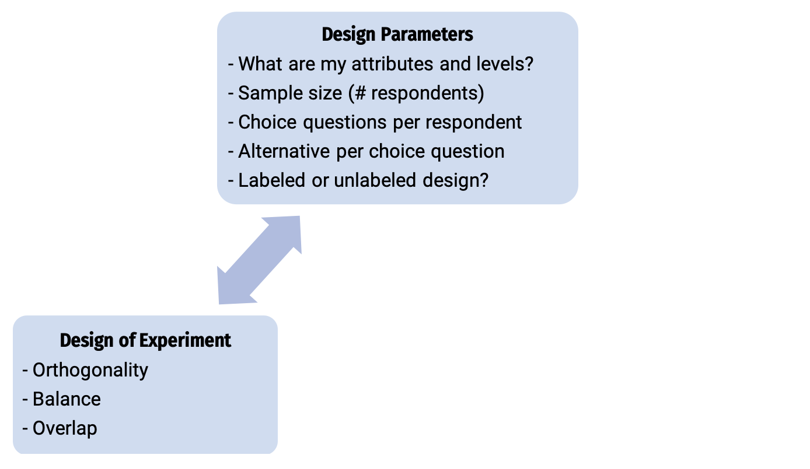
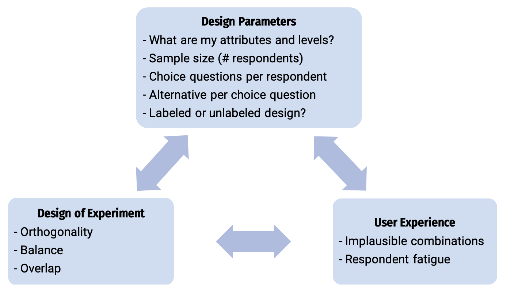
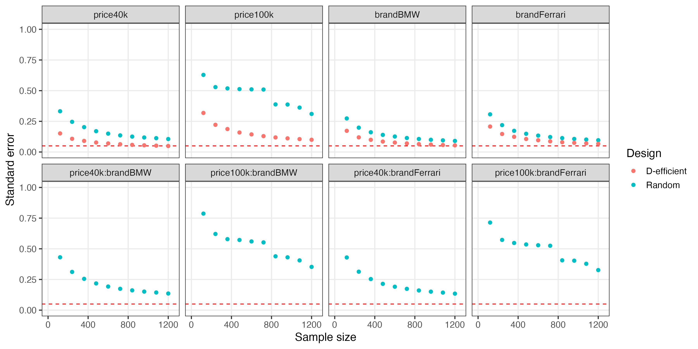

```{r setup, include=FALSE}
library(knitr)
library(fontawesome)
library(tidyverse)
library(metathis)
library(logitr)
library(cbcTools)

options(
  htmltools.dir.version = FALSE,
  knitr.table.format = "html",
  knitr.kable.NA = '',
  dplyr.width = Inf,
  width = 250
)

knitr::opts_chunk$set(
  cache = FALSE,
  warning = FALSE,
  message = FALSE,
  fig.path = "figs/",
  fig.width = 7.252,
  fig.height = 4,
  comment = "#>",
  fig.retina = 3
)

# Setup xaringanExtra options
xaringanExtra::use_xaringan_extra(c(
  "tile_view", "panelset", "share_again"))
xaringanExtra::style_share_again(share_buttons = "none")
xaringanExtra::use_extra_styles(
  hover_code_line = TRUE,
  mute_unhighlighted_code = FALSE
)

# Set up website metadata
meta() %>%
  meta_general(
    description = rmarkdown::metadata$subtitle,
    generator = "xaringan and remark.js"
  ) %>%
  meta_name("github-repo" = "jhelvy/2022-sawtooth-conf") %>%
  meta_social(
    title = rmarkdown::metadata$title,
    url = "https://jhelvy.com",
    og_type = "website",
    og_author = "John Paul Helveston",
    twitter_card_type = "summary_large_image",
    twitter_creator = "@johnhelveston"
  )

knitr::opts_chunk$set(
    warning = FALSE,
    message = FALSE,
    comment = "#>",
    fig.path = "figs/",
    fig.retina = 3 # Better figure resolution
)
```

layout: true

<!-- this adds the link footer to all slides, depends on my-footer class in css-->

<div class="footer-small">
<span>
https://github.com/jhelvy/2022-sawtooth-conf
</span>
</div>

---

name: title-slide
class: inverse, middle
background-image: url(images/blue.jpg)

# The `cbcTools` Package <a href='https://jhelvy.github.io/cbcTools/'></a>

## Tools for Designing and Testing<br>Choice-Based Conjoint Surveys in `r fa("r-project", fill = "white")`

### by John Paul Helveston

Sawtooth Software Conference

May 06, 2022

---

class: center

### Designing a Choice-Based Conjoint Survey is Hard

--

<center>

</center>

---

class: center

### Designing a Choice-Based Conjoint Survey is Hard

<center>

</center>

---

class: center

### Designing a Choice-Based Conjoint Survey is Hard

<center>

</center>

---

# .center[A simple conjoint experiment about _cars_]

Attribute | Levels
----------|----------
Brand     | GW, BMW, Ferrari 
Price     | $20k, $40k, $100k

.center[**Design: .red[9] choice sets, .blue[3] alternatives each**]

--

.leftcol[

```
Attribute counts:

brand:
  GM   BMW  Ferrari 
  10    11    6 

price:

 20k  40k 100k 
  9    9   9
```

]

--

.rightcol[

```
Pairwise attribute counts:

brand & price:
         
          20k 40k 100k
  GM        3   0    7
  BMW       4   5    2
  Ferrari   2   4    0
```

]

---

# .center[A simple conjoint experiment about _cars_]

Attribute | Levels
----------|----------
Brand     | GW, BMW, Ferrari 
Price     | $20k, $40k, $100k

.center[**Design: .red[90] choice sets, .blue[3] alternatives each**]

--

.leftcol[

```
Attribute counts:

brand:
  GM    BMW   Ferrari 
  92    80     98

price:

  20k  40k 100k 
  91   84   95 
```

]

--

.rightcol[

```
Pairwise attribute counts:

brand & price:
         
          20k 40k 100k
  GM      31  31  30
  BMW     25  25  30
  Ferrari 35  28  35
```

]

---

# .center[D-efficient designs]

### .center[Attempts to maximize information on "Main Effects"]

--

.leftcol[

```
Attribute counts:

brand:
  GM    BMW   Ferrari 
  90    90     90 

price:

  20k  40k 100k 
  90   90  90
```

]

--

.rightcol[

```
Pairwise attribute counts:

brand & price:
         
          20k 40k 100k
  GM      30  30  30
  BMW     30  30  30
  Ferrari 30  30  30
```

]

---

# .center[D-efficient designs]

### .center[Attempts to maximize information on .red[Main Effects]]

--

<center>

</center>

---

# .center[D-efficient designs]

### .center[...but .red[interaction effects] are confounded in D-efficient designs]

--

<center>

</center>

---

# .center[But what about other factors?]

<br>

- What if I add one more choice question to each respondent?

--

- What if I increase the number of alternatives per choice question?

--

- What if I use a labeled design?

--

- What if there are interaction effects?

---

class: middle, center, inverse 

# The `cbcTools` Package 

<center>

</center>

---

background-image: url("images/process.png")

---

background-image: url("images/process_labels.png")

---

class: center, middle 
background-image: url("images/process_labels.png")

.border[
<center>

</center>
]

---

background-image: url("images/process_levels.png")

---


---

background-image: url("images/process_profiles.png")

---

background-image: url("images/process_design.png")

---

background-image: url("images/process_inspect.png")

---

background-image: url("images/process_choices.png")

---

background-image: url("images/process_power.png")

---

Full workflow example: apples

---

Comparison examples

Labeled vs. unlabeled

---

Iteractions vs. no interactions

# .center[Example: Wine Pairings]

.leftcol40[

meat | wine
-----|------
fish | white
fish | red
steak | white
steak | red

]

--

.rightcol60[

## Main Effects

1. **Fish** or **Steak**?
2. **Red** or **White** wine?

## Interaction Effects

1. **Red** or **White** wine _with **Steak**_?
2. **Red** or **White** wine _with **Fish**_?
]


---

class: inverse
background-image: url(images/blue.jpg)

<br>

# .center[.font150[Thanks!]]

### `cbcTools` documentation: https://jhelvy.github.io/cbcTools/

### Slides: https://jhelvy.github.io/2022-sawtooth-conf

.footer-large[
.right[
@johnhelveston `r fa(name = "twitter", fill = "white")`<br>
@jhelvy `r fa(name = "github", fill = "white")`<br>
@jhelvy `r fa(name = "weixin", fill = "white")`<br>
jhelvy.com `r fa(name = "link", fill = "white")`<br>
jph@gwu.edu `r fa(name = "paper-plane", fill = "white")`
]]

---

class: center, middle, inverse 

# Extra slides
