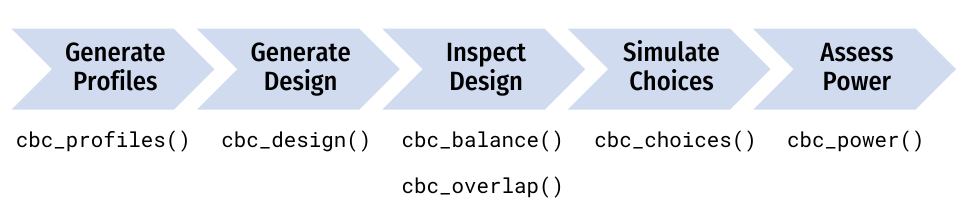

```{r setup, include=FALSE}
knitr::opts_chunk$set(
  warning = FALSE,
  message = FALSE,
  fig.path = "figs/",
  fig.width = 7.252,
  fig.height = 4,
  comment = "#>",
  fig.retina = 3
)

library(cbcTools)
library(kableExtra)
library(dplyr)
library(gt)
```

# Introduction 

Designing a choice-based conjoint survey is almost never a simple, straightforward process. Designers must consider multiple trade offs between design parameters (e.g., which attributes and levels to include, how many choice questions to ask each respondent, and how many alternatives per choice question) and the design outcomes in terms of the user experience and the statistical power available for identifying effects. The process is typically highly iterative.

As a quick example, consider a simple conjoint experiment about cars with just two attributes with three levels each: 

- Price:  $20,000, 40,000, & 100,000
- Brand: GM, BMW, & Ferrari

A simple starting point is to generate a design by randomly choosing combinations of brands and prices from the full set of all possible profiles. Once created, one of the first things designers examine is the count of how often each level of each attribute is shown. The table below shows an example of the counts from a random design with 9 choice sets of 3 alternatives per question:

```{r, echo=FALSE}
kbl(
  tibble(
    "Price:" = c("Brand", "GM", "BMW", "Ferrari"),
    "   " = c(" ", 10, 11, 6),
    "$20,000" = c(9, 3, 4, 2), 
    "$40,000" = c(9, 0, 5, 4), 
    "$100,000" = c(9, 7, 2, 0)
  ),
  booktabs = TRUE, 
  caption = "Individual and pairwise counts of attributes."
) %>% 
  kable_styling(latex_options = c("striped", "hold_position"))
```

Based on the counts alone, it is clear that this design has several problems. First, while the price levels are perfectly balanced (each level is shown 9 times), the brand levels are not -- GW and BMW are shown 10 and 11 times, respectively, whereas Ferrari is only shown 6 times. And the pairwise counts are particularly troubling. The Ferrari brand is only shown with a price of $20,000 and $40,000 and never at the $100,000 level (the most logical level for a Ferrari!). Likewise, GM brand is shown with a price of $100,000 in 7 out of 10 times and never with a price of $40,000.

This rather poor design is a common outcome when using a randomized design with a small number of choice sets. Simply increasing the number of choice sets often results in a much better balance. For example, if we increase the number from 9 to 90, we obtain the following counts:

```{r, echo=FALSE}
kbl(
  tibble(
    "Price:" = c("Brand", "GM", "BMW", "Ferrari"),
    "   " = c(" ", 92, 80, 98),
    "$20,000" = c(91, 31, 25, 35), 
    "$40,000" = c(84, 31, 25, 30), 
    "$100,000" = c(95, 30, 30, 35)
  ),
  booktabs = TRUE, 
  caption = "Individual and pairwise counts of attributes."
) %>% 
  kable_styling(latex_options = c("striped", "hold_position"))
```

This design has a much better balance across the attribute levels than the one created from just 9 choice sets. However, it too has issues. Consider, for example, that about 1/3 of the time the Ferrari brand is shown it has a price of just $20,000. This is obviously an unrealistic profile, and if a user saw such a profile multiple times they may not take the choice exercise seriously.

One approach to try to correct this outcome is to use a Bayesian D-efficient design. This approach allows the designer to list a set of priors on the expected coefficients for each attribute level and then use an algorithm to select combinations of profiles that maximize the information available to identify main effects.


```{r, echo=FALSE}
kbl(
    tibble(
        Attribute = c("Price", "", "", "Brand", "", ""),
        Level = c("$20,000", "$40,000", "$100,000", "GM", "BMW", "Ferrari"),
        `Prior` = c(0, -1, -4, 0, 1, 2)
    ),
    booktabs = TRUE,
    caption = "Example conjoint attributes and levels."
) %>% 
    kable_styling(latex_options = c("striped", "hold_position"))
```

Using a Bayesian D-efficient design with 90 choice sets and the prior utilities in Table 3, the counts become much more reasonable (see Table 4). Now the individual attribute counts are relatively balanced, and the pairwise combinations of attributes are much more plausible. For example, the GM brand is only shown at price levels of $20,000 and $40,000, and about half of the time Ferrari is shown at the $100,000 price level.

```{r, echo=FALSE}
kbl(
  tibble(
    "Price:" = c("Brand", "GM", "BMW", "Ferrari"),
    "   " = c(" ", 93, 90, 86),
    "$20,000" = c(97, 52, 30, 15), 
    "$40,000" = c(93, 41, 30, 22), 
    "$100,000" = c(78, 0, 30, 49)
  ),
  booktabs = TRUE, 
  caption = "Individual and pairwise counts of attributes."
) %>% 
  kable_styling(latex_options = c("striped", "hold_position"))
```

Of course, even Bayesian D-efficient designs have their downsides. In particular, they can become problematic if there are significant interaction effects between any of the attributes. Figure 1 highlights this trade off. The plots show the standard errors of each coefficients from the same model estimated using increasing subsets of two simulated data sets: a randomized design and a Bayesian D-efficient design. In the first row, it is clear that the D-efficient design produces lower standard errors for the same sample size compared to the randomized design. However, the second row shows the standard errors on interaction effects, which are not identifiable using the D-efficient design. This is because interaction effects can become confounded with main effects in D-efficient designs. Thus, if interaction effects are expected, a randomized design may be a more appropriate choice.

```{r, echo=FALSE, fig.align='center', fig.cap="Standard errors with increasing sample size for a multinomial logit model with interaction effects estimated using a randomized design versus a Bayesian D-efficient design", out.width="100%"}
knitr::include_graphics("figs/design_compare.png")
```

# The `cbcTools` Package

As the previous example illustrates, designing a choice-based conjoint experiment is an iterative process, and designers must consider a wide range of factors. The `cbcTools` package was designed as a tool for helping designers navigate this process and to understand the impacts different design decisions could have on the statistical power of the experiment prior to fielding the survey. 

The package provides a set of functions (each starting with `cbc_`) for designing surveys and conducting power analyses for choice-based conjoint survey experiments in R. The typical workflow involves a series of steps, and each step has a function associated with it (see Figure 2).

```{r, echo=FALSE, fig.align='center', fig.cap="Diagram of the choice-based conjoint survey design process", out.width="100%"}

```

The rest of this paper explains each of these steps using a detailed example of a simple conjoint experiment about apples.

## Generating profiles

The first step in designing an experiment is to define the attributes and levels for the experiment and then generate all of the `profiles` of each possible combination of those attributes and levels. For example, consider designing a conjoint experiment about apples with the following three attributes: `price`, `type`, and `freshness`. All of the possible profiles for these attributes can be obtained using the `cbc_profiles()` function:

```{r}
profiles <- cbc_profiles(
  price     = seq(1, 4, 0.5), # $ per pound
  type      = c('Fuji', 'Gala', 'Honeycrisp'),
  freshness = c('Poor', 'Average', 'Excellent')
)

nrow(profiles)
head(profiles)
tail(profiles)
```

Depending on the context of the survey, some profiles may need to be eliminated (e.g., some profile combinations may be illogical or unrealistic).^[Note that including hard constraints in your designs can substantially reduce the statistical power of your design, so use them cautiously and avoid them if possible.] To do so, each level of an attribute can be defined as a list defining those contraints. In the example below, the `type` attribute has constraints such that only certain price levels will be shown for each level. In addition, for the `"Honeycrisp"` level of the `type` attribute, only two of the three `freshness` levels are included: `"Excellent"` and `"Average"`. Note that both the other attributes (`price` and `freshness`) should contain all of the possible levels. With these constraints, only 30 profiles are available compared to 63 without constraints.

```{r}
profiles <- cbc_profiles(
  price = c(1, 1.5, 2, 2.5, 3, 3.5, 4, 4.5, 5),
  freshness = c('Poor', 'Average', 'Excellent'),
  type = list(
    "Fuji" = list(
        price = c(2, 2.5, 3)
    ),
    "Gala" = list(
        price = c(1, 1.5, 2)
    ),
    "Honeycrisp" = list(
        price = c(2.5, 3, 3.5, 4, 4.5, 5),
        freshness = c("Average", "Excellent")
    )
  )
)

nrow(profiles)
head(profiles)
tail(profiles)
```

```{r, include=FALSE}
profiles <- cbc_profiles(
  price     = seq(1, 4, 0.5), # $ per pound
  type      = c('Fuji', 'Gala', 'Honeycrisp'),
  freshness = c('Poor', 'Average', 'Excellent')
)
```

## Generating designs

### Randomized designs

Once a set of profiles is obtained, a randomized conjoint survey can then be generated using the `cbc_design()` function:

```{r}
design <- cbc_design(
  profiles = profiles,
  n_resp   = 900, # Number of respondents
  n_alts   = 3,   # Number of alternatives per question
  n_q      = 6    # Number of questions per respondent
)

dim(design)  # View dimensions
head(design) # Preview first 6 rows
```

For now, the `cbc_design()` function only generates a randomized design. Other packages, such as the [`idefix`](https://github.com/traets/idefix) package, are able to generate other types of designs, including Bayesian D-efficient designs, and future versions of the `cbcTools` package will add a wrapper around the `idefix` package to integrate some of these features. The randomized design simply samples from the set of `profiles` while ensuring that no two profiles are the same in any choice question. 

The structure of the resulting `design` data frame is such that each row specifies the levels shown for one alternative in a choice question. In addition to the attribute levels, the `design` data frame also includes the following variables for identifying different aspects of the survey:

- `respID`: Identifies each survey respondent.
- `qID`: Identifies the choice question answered by the respondent.
- `altID`:Identifies the alternative in any one choice observation.
- `obsID`: Identifies each unique choice observation across all respondents.
- `profileID`: Identifies the profile in `profiles`.

### Labeled designs (a.k.a. "alternative-specific" designs)

A "labeled" design (also known as an "alternative-specific" design) can also be generated. In labeled designs, the levels of one attribute are used as the labels for each alternative. To do so, the `label` argument can be set to one of the attributes. This by definition also sets the number of alternatives in each question to the number of levels in the chosen attribute, so the `n_alts` argument is overridden. In the example below, the `type` attribute is used as the label:

```{r}
design_labeled <- cbc_design(
  profiles  = profiles,
  n_resp    = 900, # Number of respondents
  n_alts    = 3,   # Number of alternatives per question
  n_q       = 6,   # Number of questions per respondent
  label     = "type" # Set the "type" attribute as the label
)

dim(design_labeled)
head(design_labeled)
```

In the above example, the `type` attribute is now fixed to be the same order for every choice question, ensuring that each level in the `type` attribute will always be shown in each choice question.

### Adding a "no choice" option (a.k.a. "outside good")

You can include a "no choice" (also known as "outside good") option in the survey by setting `no_choice = TRUE`. If included, all categorical attributes will be dummy-coded to appropriately dummy-code the "no choice" alternative.

```{r}
design_nochoice <- cbc_design(
  profiles  = profiles,
  n_resp    = 900, # Number of respondents
  n_alts    = 3, # Number of alternatives per question
  n_q       = 6, # Number of questions per respondent
  no_choice = TRUE
)

dim(design_nochoice)
head(design_nochoice)
```

## Inspecting designs

The package includes some functions to quickly inspect some basic metrics of a design. The `cbc_balance()` function prints out a summary of the counts of each level for each attribute across all choice questions as well as the two-way counts across all pairs of attributes for a given design:

```{r}
cbc_balance(design)
```

Similarly, the `cbc_overlap()` function prints out a summary of the amount of "overlap" across attributes within the choice questions. For example, for each attribute, the count under `"1"` is the number of choice questions in which the same level was shown across all alternatives for that attribute (because there was only one level shown). Likewise, the count under `"2"` is the number of choice questions in which only two unique levels of that attribute were shown, and so on:

```{r}
cbc_overlap(design)
```

## Simulating choices

Choices for a given `design` can be simulated using the `cbc_choices()` function. By default, random choices are simulated:

```{r}
data <- cbc_choices(
  design = design,
  obsID  = "obsID"
)

head(data)
```

Choices can also be simulated according to an assumed prior model. The default model used is a multinomial logit model with fixed parameters. In the example below, the choices are simulated using a utility model with the following parameters:

- 1 continuous parameter for `price`
- 2 categorical parameters for `type` (`'Gala'` and `'Honeycrisp'`)
- 2 categorical parameters for `freshness` (`"Average"` and `"Excellent"`)

Note that for categorical variables (`type` and `freshness` in this example), the first level defined when using `cbc_profiles()` is set as the reference level. The example below defines the following utility model for simulating choices for each alternative _j_:

$$
u_j = 0.1price_j + 0.1type^\mathrm{Gala}_j + 0.2type^\mathrm{Honeycrisp}_j + 0.1freshness^\mathrm{Average}_j + 0.2freshness^\mathrm{Excellent}_j + \varepsilon_j
$$

```{r, eval=FALSE}
data <- cbc_choices(
  design = design,
  obsID = "obsID",
  priors = list(
    price     = 0.1,
    type      = c(0.1, 0.2),
    freshness = c(0.1, 0.2)
  )
)
```

The prior model used for simulating choices can also include other, more complex models, such as models that include interaction terms or mixed logit models. For example, the example below is the same as the previous example but with an added interaction between `price` and `type`:

```{r, eval=FALSE}
data <- cbc_choices(
  design = design,
  obsID = "obsID",
  priors = list(
    price = 0.1,
    type = c(0.1, 0.2),
    freshness = c(0.1, 0.2),
    `price*type` = c(0.1, 0.5)
  )
)
```

To simulate choices according to a mixed logit model where parameters follow a normal or log-normal distribution across the population, the `randN()` and `randLN()` functions can be used inside the `priors` list. The example below models the `type` attribute with two random normal parameters using a vector of means (`mean`) and standard deviations (`sd`) for each level of `type`:

```{r, eval=FALSE}
data <- cbc_choices(
  design = design,
  obsID = "obsID",
  priors = list(
    price = 0.1,
    type = randN(mean = c(0.1, 0.2), sd = c(1, 2)),
    freshness = c(0.1, 0.2)
  )
)
```

## Analyzing power

The simulated choice data can be used to conduct a power analysis by estimating the same model multiple times with incrementally increasing sample sizes. As the sample size increases, the estimated coefficient standard errors will decrease (i.e. coefficient estimates become more precise). The `cbc_power()` function achieves this by partitioning the choice data into multiple sizes (defined by the `nbreaks` argument) and then estimating a user-defined choice model on each data subset. In the example below, 10 different sample sizes are used. All models are estimated using the [{logitr}](https://jhelvy.github.io/logitr) package:

```{r}
power <- cbc_power(
  data    = data,
  pars    = c("price", "type", "freshness"),
  outcome = "choice",
  obsID   = "obsID",
  nbreaks = 10,
  n_q     = 6
)

head(power)
tail(power)
```

The `power` data frame contains the coefficient estimates and standard errors for each sample size. You can quickly visualize the outcome to identify a required sample size for a desired level of parameter precision by using the `plot()` method:

```{r power}
plot(power)
```

If you want to examine any other aspects of the models other than the standard errors, you can set `return_models = TRUE` and `cbc_power()` will return a list of estimated models. The example below prints a summary of the last model in the list of models:

```{r}
library(logitr)

models <- cbc_power(
  data    = data,
  pars    = c("price", "type", "freshness"),
  outcome = "choice",
  obsID   = "obsID",
  nbreaks = 10,
  n_q     = 6,
  return_models = TRUE
)

summary(models[[10]])
```

## Piping it all together!

One of the convenient features of how the package is written is that the object generated in each step is used as the first argument to the function for the next step. Thus, just like in the overall program diagram, the functions can be piped together:

```{r, eval=FALSE}
cbc_profiles(
  price     = seq(1, 4, 0.5), # $ per pound
  type      = c('Fuji', 'Gala', 'Honeycrisp'),
  freshness = c('Poor', 'Average', 'Excellent')
) |>
cbc_design(
  n_resp   = 900, # Number of respondents
  n_alts   = 3,   # Number of alternatives per question
  n_q      = 6    # Number of questions per respondent
) |>
cbc_choices(
  obsID = "obsID",
  priors = list(
    price     = 0.1,
    type      = c(0.1, 0.2),
    freshness = c(0.1, 0.2)
  )
) |>
cbc_power(
    pars    = c("price", "type", "freshness"),
    outcome = "choice",
    obsID   = "obsID",
    nbreaks = 10,
    n_q     = 6
) |>
plot()
```

```{r, ref.label='power', echo=FALSE}
```

## Author, Version, and License Information

- Author: *John Paul Helveston* https://www.jhelvy.com/
- Date First Written: *October 23, 2020*
- License: [MIT](https://github.com/jhelvy/cbcTools/blob/master/LICENSE.md)

## Citation Information

If you use this package for in a publication, I would greatly appreciate it if you cited it - you can get the citation by typing `citation("cbcTools")` into R:

```{r}
citation("cbcTools")
```


# References {-}
